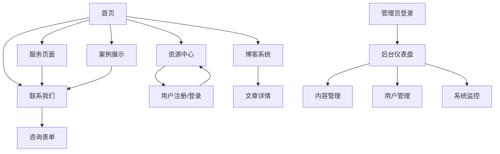

# CCPM360 关键链项目管理咨询平台 - 产品需求文档

## 1. 产品概述

CCPM360是一个专业的关键链项目管理（Critical Chain Project Management）咨询服务平台，为企业提供CCPM理论培训、项目管理咨询、工具模板和最佳实践案例。平台通过线上展示、资源分享和专业咨询服务，帮助企业提升项目管理效率，缩短项目周期，提高项目成功率。

目标市场：核电站、风电站等大型工程建设等需要复杂项目管理的企业和项目经理。

## 2. 核心功能

### 2.1 用户角色

| 角色     | 注册方式 | 核心权限                               |
| -------- | -------- | -------------------------------------- |
| 访客用户 | 无需注册 | 浏览公开内容、查看案例、下载部分资源   |
| 注册用户 | 邮箱注册 | 下载完整资源、参与评论、收藏内容       |
| 管理员   | 后台分配 | 内容管理、用户管理、数据分析、系统配置 |

### 2.2 功能模块

我们的CCPM360平台包含以下主要页面：

1. **首页**：品牌展示、服务介绍、成功案例轮播、快速导航
2. **服务页面**：CCPM咨询服务、培训课程、实施指导详细介绍
3. **案例展示页**：客户成功案例、项目效果展示、行业应用案例
4. **资源中心**：文档下载、视频教程、工具模板、实践指南
5. **博客系统**：行业资讯、技术文章、最佳实践分享
6. **联系我们**：公司信息、联系方式、在线咨询、地图导航
7. **后台管理**：内容管理、用户管理、数据分析、系统监控

### 2.3 页面详情

| 页面名称   | 模块名称 | 功能描述                                       |
| ---------- | -------- | ---------------------------------------------- |
| 首页       | 英雄区域 | 展示公司品牌形象、核心价值主张、CTA按钮引导    |
| 首页       | 服务概览 | 展示主要服务类型、服务特色、服务流程           |
| 首页       | 成功案例 | 轮播展示客户案例、项目成果、客户评价           |
| 首页       | 统计数据 | 展示服务客户数、项目成功率、行业覆盖等关键指标 |
| 服务页面   | 服务详情 | 详细介绍CCPM咨询、培训、实施等服务内容         |
| 服务页面   | 服务流程 | 展示服务实施步骤、时间安排、交付成果           |
| 服务页面   | 价格方案 | 展示不同服务套餐、价格对比、联系咨询           |
| 案例展示页 | 案例列表 | 分类展示客户案例、支持筛选和搜索               |
| 案例展示页 | 案例详情 | 详细展示项目背景、实施过程、效果对比           |
| 案例展示页 | 案例图库 | 展示项目实施照片、图表、文档截图               |
| 资源中心   | 资源分类 | 按类型分类展示文档、视频、模板等资源           |
| 资源中心   | 资源搜索 | 支持关键词搜索、标签筛选、分类过滤             |
| 资源中心   | 资源下载 | 提供资源预览、下载统计、用户评价               |
| 博客系统   | 文章列表 | 展示博客文章、支持分类和标签筛选               |
| 博客系统   | 文章详情 | 展示文章内容、相关推荐、评论互动               |
| 博客系统   | 文章管理 | 后台文章发布、编辑、分类管理                   |
| 联系我们   | 联系信息 | 展示公司地址、电话、邮箱、营业时间             |
| 联系我们   | 在线表单 | 提供咨询表单、留言功能、自动回复               |
| 联系我们   | 地图导航 | 集成百度地图、显示公司位置、交通指引           |
| 后台管理   | 仪表盘   | 展示关键数据指标、访问统计、系统状态           |
| 后台管理   | 内容管理 | 管理页面内容、资源文件、博客文章               |
| 后台管理   | 用户管理 | 管理用户账户、权限分配、活动统计               |
| 后台管理   | 系统监控 | 监控系统性能、API使用量、错误日志              |

## 3. 核心流程

### 访客用户流程

用户访问首页了解服务 → 浏览案例和资源 → 填写咨询表单或直接联系 → 获得专业咨询服务

### 注册用户流程

用户注册账户 → 浏览和下载资源 → 参与博客评论 → 收藏感兴趣内容 → 获得持续价值

### 管理员流程

管理员登录后台 → 查看数据仪表盘 → 管理内容和用户 → 监控系统状态 → 优化运营策略

## 4. 用户界面设计

### 4.1 设计风格

- **主色调**：专业蓝色 (#2563eb)、辅助色深蓝 (#1e40af)

- **按钮样式**：圆角设计、渐变效果、悬停动画

- **字体**：中文使用思源黑体，英文使用 Inter，主要字号 16px

- **布局风格**：卡片式设计、顶部导航、响应式布局

- **图标风格**：线性图标、统一风格、适当动效

### 4.2 页面设计概览

| 页面名称 | 模块名称 | UI元素                                        |
| -------- | -------- | --------------------------------------------- |
| 首页     | 英雄区域 | 全屏背景图、大标题、副标题、CTA按钮、渐变遮罩 |
| 首页     | 服务卡片 | 3列网格布局、图标+标题+描述、悬停效果         |
| 首页     | 案例轮播 | 自动轮播、指示器、左右箭头、卡片阴影          |
| 服务页面 | 服务详情 | 左右分栏、图文混排、时间线展示、价格表格      |
| 案例展示 | 案例网格 | 瀑布流布局、图片预览、标签展示、筛选器        |
| 资源中心 | 资源列表 | 列表+卡片混合、下载按钮、进度条、评分星级     |
| 博客系统 | 文章列表 | 时间线布局、摘要预览、阅读时间、分类标签      |
| 联系我们 | 联系表单 | 双栏布局、表单验证、地图集成、联系卡片        |
| 后台管理 | 仪表盘   | 数据卡片、图表展示、快捷操作、状态指示器      |

### 4.3 响应式设计

产品采用移动优先的响应式设计，支持桌面端、平板和手机端访问，针对触屏设备优化交互体验，确保在各种设备上都能提供良好的用户体验。
