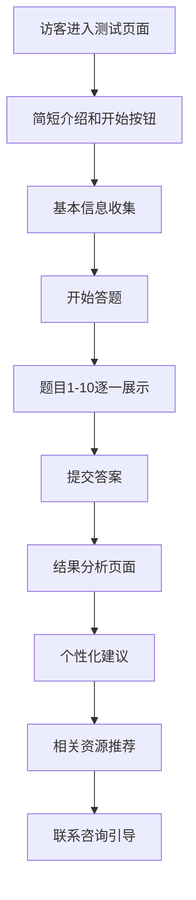

# CCPM360 项目管理理念测试功能设计方案

## 1. 功能定位和目标

### 1.1 功能定位

**"项目管理思维诊断器"** - 一个互动式的项目管理理念测试工具，通过精心设计的情景化选择题，让访客在不知不觉中发现传统项目管理方法的局限性，从而认识到关键链项目管理（CCPM）的价值。

### 1.2 核心目标

- **认知唤醒**：触动访客对传统项目管理方法的反思
- **价值认知**：让访客主动发现CCPM的优势
- **需求激发**：激发访客对专业咨询服务的需求
- **线索收集**：收集高质量的潜在客户信息
- **品牌建立**：树立CCPM360的专业权威形象

## 2. 题目设计策略

### 2.1 设计原则

- **情景化**：基于真实项目场景，让用户有代入感
- **渐进式**：从简单到复杂，逐步揭示传统方法的问题
- **对比性**：通过选项对比突出不同方法的差异
- **启发性**：不直接给答案，而是引导用户思考
- **实用性**：题目贴近用户实际工作场景

### 2.2 题目分类设计

#### A. 时间估算与缓冲区管理（3-4题）

**核心矛盾**：传统方法要求精确估算 vs 实际项目的不确定性

**示例题目1：**

> 你的团队需要开发一个新功能，技术负责人估算需要10天。作为项目经理，你会如何安排进度？
>
> A. 按10天安排，要求团队严格执行
> B. 加上20%缓冲，安排12天
> C. 加上50%缓冲，安排15天
> D. 不在任务级别加缓冲，而是在项目整体层面统一管理缓冲

**设计意图**：揭示传统方法在每个任务都加缓冲导致的浪费问题

#### B. 多任务与资源冲突（3-4题）

**核心矛盾**：多项目并行 vs 资源有限性

**示例题目2：**

> 你的核心开发人员同时被分配到3个项目中，每个项目都很重要。你会如何处理？
>
> A. 让他同时推进3个项目，合理分配时间
> B. 按项目优先级排序，让他专注于最重要的项目
> C. 增加人手，减轻他的负担
> D. 重新评估项目计划，避免关键资源冲突

**设计意图**：揭示多任务切换的效率损失问题

#### C. 项目监控与控制（2-3题）

**核心矛盾**：里程碑控制 vs 关键链保护

**示例题目3：**

> 项目进行到一半，发现某个非关键任务延期了2天。你的第一反应是？
>
> A. 立即要求该任务负责人加班赶进度
> B. 调整后续任务安排，压缩其他任务时间
> C. 先分析这个延期是否会影响项目整体进度
> D. 启动风险应对预案

**设计意图**：揭示传统方法过度关注局部而忽视整体的问题

#### D. 团队协作与沟通（2-3题）

**核心矛盾**：个人绩效 vs 团队目标

**示例题目4：**

> 团队成员小李提前完成了任务，你会如何安排？
>
> A. 表扬小李，让他休息或做其他工作
> B. 让小李帮助其他还在进行中的任务
> C. 安排小李开始下一个任务
> D. 让小李检查和优化已完成的工作

**设计意图**：揭示传统方法中"提前完成"可能带来的问题

### 2.3 选项设计技巧

- **A选项**：通常是传统方法的典型做法
- **B选项**：传统方法的改进版本
- **C选项**：看似合理但有隐患的做法
- **D选项**：CCPM的核心理念（但不明说）

## 3. 交互流程设计

### 3.1 测试流程



### 3.2 页面设计要点

#### 开始页面

- **标题**："您的项目管理思维诊断"
- **副标题**："10道题，发现项目管理的新视角"
- **预期时间**："仅需5分钟"
- **价值承诺**："获得个性化的项目管理改进建议"

#### 信息收集页面

- 姓名（必填）
- 邮箱（必填）
- 公司/职位（选填）
- 项目管理经验（选择：1年以下/1-3年/3-5年/5年以上）
- 主要行业（选择：制造业/IT/建筑/其他）

#### 答题页面

- 进度条显示
- 题目编号（如：第3题/共10题）
- 清晰的题目描述
- 四个选项，单选
- "下一题"按钮
- 允许返回修改（但不显示正确答案）

#### 结果页面

- 个性化分析报告
- 得分可视化
- 详细解释和建议
- 相关资源链接
- 咨询预约按钮

## 4. 结果分析和个性化建议

### 4.1 评分机制

#### 维度评分

- **时间管理思维**（25分）
- **资源协调能力**（25分）
- **风险控制意识**（25分）
- **团队协作理念**（25分）

#### 总分等级

- **85-100分**："CCPM先锋者" - 您已具备现代项目管理思维
- **70-84分**："进阶学习者" - 您在某些方面需要提升
- **55-69分**："传统实践者" - 建议学习新的项目管理方法
- **40-54分**："方法探索者" - 急需系统性的项目管理培训
- **40分以下**："基础建设者" - 建议从基础开始学习

### 4.2 个性化建议模板

#### 高分用户（85+）

```
恭喜！您已经具备了现代项目管理的核心思维。

您的优势：
- 理解缓冲区的重要性
- 重视资源约束和协调
- 具备系统性思维

建议：
- 深入学习CCPM的具体实施方法
- 考虑在组织中推广这些理念
- 关注我们的高级实践案例
```

#### 中等分数用户（55-84）

```
您在项目管理方面有一定基础，但还有提升空间。

需要关注的领域：
- [根据失分点个性化]
- 时间缓冲的科学管理
- 多项目环境下的资源协调

建议：
- 下载我们的《CCPM入门指南》
- 参加我们的在线研讨会
- 考虑一对一咨询服务
```

#### 低分用户（54以下）

```
项目管理是一门科学，需要系统性学习。

当前挑战：
- 可能过度依赖传统方法
- 缺乏对现代项目管理理论的了解
- 需要更新管理思维

建议：
- 参加我们的基础培训课程
- 阅读相关书籍和资料
- 预约免费咨询，制定学习计划
```

## 5. 引导转化机制

### 5.1 分层转化策略

#### 高分用户转化

- **目标**：高端咨询服务
- **策略**：突出高级实践和定制化服务
- **CTA**："预约高级咨询师深度交流"

#### 中分用户转化

- **目标**：培训课程和标准咨询
- **策略**：提供学习路径和成长方案
- **CTA**："获取个性化学习方案"

#### 低分用户转化

- **目标**：基础培训和资料下载
- **策略**：免费资源吸引，建立信任
- **CTA**："下载免费入门资料包"

### 5.2 后续跟进机制

#### 邮件营销序列

1. **即时邮件**：测试结果和详细报告
2. **3天后**：相关案例分享
3. **1周后**：免费资源推荐
4. **2周后**：在线活动邀请
5. **1个月后**：个性化咨询邀请

#### 内容推荐

- 根据得分推荐相关博客文章
- 推荐适合的案例研究
- 提供相关的工具模板

## 6. 技术实现方案

### 6.1 前端实现

#### 页面结构

```
/assessment/
├── index.tsx          # 测试首页
├── questions.tsx      # 答题页面
├── result.tsx         # 结果页面
└── components/
    ├── QuestionCard.tsx
    ├── ProgressBar.tsx
    ├── ResultChart.tsx
    └── RecommendationCard.tsx
```

#### 状态管理

```typescript
interface AssessmentState {
  userInfo: {
    name: string;
    email: string;
    company?: string;
    experience: string;
    industry: string;
  };
  answers: number[];
  currentQuestion: number;
  isCompleted: boolean;
  result?: AssessmentResult;
}
```

#### 核心组件设计

```typescript
// 题目数据结构
interface Question {
  id: number;
  category: 'time' | 'resource' | 'control' | 'team';
  scenario: string;
  question: string;
  options: {
    text: string;
    score: number;
    explanation: string;
  }[];
}

// 结果数据结构
interface AssessmentResult {
  totalScore: number;
  categoryScores: {
    time: number;
    resource: number;
    control: number;
    team: number;
  };
  level: string;
  recommendations: string[];
  resources: Resource[];
}
```

### 6.2 后端实现

#### API设计

```typescript
// 提交测试结果
POST /api/assessment/submit
{
  userInfo: UserInfo;
  answers: number[];
}

// 获取测试结果
GET /api/assessment/result/:id

// 获取题目列表
GET /api/assessment/questions
```

#### 数据库设计

```sql
-- 测试记录表
CREATE TABLE assessment_records (
  id UUID PRIMARY KEY DEFAULT gen_random_uuid(),
  user_name VARCHAR(100) NOT NULL,
  user_email VARCHAR(255) NOT NULL,
  company VARCHAR(200),
  experience VARCHAR(50),
  industry VARCHAR(100),
  answers JSONB NOT NULL,
  total_score INTEGER NOT NULL,
  category_scores JSONB NOT NULL,
  level VARCHAR(50) NOT NULL,
  created_at TIMESTAMP WITH TIME ZONE DEFAULT NOW(),
  updated_at TIMESTAMP WITH TIME ZONE DEFAULT NOW()
);

-- 题目表
CREATE TABLE assessment_questions (
  id SERIAL PRIMARY KEY,
  category VARCHAR(50) NOT NULL,
  scenario TEXT NOT NULL,
  question TEXT NOT NULL,
  options JSONB NOT NULL,
  is_active BOOLEAN DEFAULT true,
  created_at TIMESTAMP WITH TIME ZONE DEFAULT NOW()
);

-- 创建索引
CREATE INDEX idx_assessment_records_email ON assessment_records(user_email);
CREATE INDEX idx_assessment_records_created_at ON assessment_records(created_at);
CREATE INDEX idx_assessment_questions_category ON assessment_questions(category);
```

### 6.3 评分算法

```typescript
function calculateScore(
  answers: number[],
  questions: Question[]
): AssessmentResult {
  const categoryScores = {
    time: 0,
    resource: 0,
    control: 0,
    team: 0,
  };

  const categoryCounts = {
    time: 0,
    resource: 0,
    control: 0,
    team: 0,
  };

  // 计算各维度得分
  answers.forEach((answerIndex, questionIndex) => {
    const question = questions[questionIndex];
    const score = question.options[answerIndex].score;
    categoryScores[question.category] += score;
    categoryCounts[question.category]++;
  });

  // 标准化分数（转换为百分制）
  Object.keys(categoryScores).forEach((category) => {
    const key = category as keyof typeof categoryScores;
    categoryScores[key] = (categoryScores[key] / categoryCounts[key]) * 25;
  });

  const totalScore = Object.values(categoryScores).reduce(
    (sum, score) => sum + score,
    0
  );

  return {
    totalScore: Math.round(totalScore),
    categoryScores,
    level: getLevel(totalScore),
    recommendations: getRecommendations(categoryScores),
    resources: getRecommendedResources(categoryScores),
  };
}
```

## 7. 数据收集和分析

### 7.1 数据收集指标

#### 用户行为数据

- 测试完成率
- 各题目的答案分布
- 用户停留时间
- 退出节点分析

#### 用户画像数据

- 行业分布
- 经验水平分布
- 得分分布
- 地域分布（通过IP）

#### 转化数据

- 资源下载率
- 咨询预约率
- 邮件订阅率
- 后续互动率

### 7.2 分析维度

#### 题目质量分析

- 各选项选择比例
- 题目区分度
- 难度系数
- 用户反馈

#### 用户分群分析

- 高分用户特征
- 不同行业的得分差异
- 经验与得分的关系
- 转化率最高的用户群体

#### 营销效果分析

- 不同渠道的用户质量
- 测试对转化的影响
- ROI分析
- 长期客户价值

### 7.3 优化策略

#### 题目优化

- 定期更新题目内容
- 根据数据调整选项设计
- 增加行业特定题目
- 优化题目难度梯度

#### 转化优化

- A/B测试不同的CTA
- 优化结果页面设计
- 个性化推荐算法
- 改进跟进流程

## 8. 实施计划

### 8.1 开发阶段（4-6周）

#### 第1-2周：基础开发

- 设计UI/UX原型
- 开发前端基础框架
- 设计数据库结构
- 开发基础API

#### 第3-4周：核心功能

- 实现答题流程
- 开发评分算法
- 实现结果展示
- 集成邮件系统

#### 第5-6周：优化完善

- 性能优化
- 移动端适配
- 数据分析功能
- 测试和调试

### 8.2 内容准备（2-3周）

- 编写10道核心题目
- 设计评分标准
- 准备个性化建议模板
- 制作相关资源内容

### 8.3 上线推广（持续）

- 软启动测试
- 收集用户反馈
- 数据分析和优化
- 正式推广

## 9. 成功指标

### 9.1 参与指标

- 月测试完成数：目标500+
- 测试完成率：目标80%+
- 用户满意度：目标4.5/5

### 9.2 转化指标

- 资源下载率：目标60%+
- 咨询预约率：目标15%+
- 邮件订阅率：目标70%+

### 9.3 业务指标

- 新客户获取成本降低20%
- 销售线索质量提升30%
- 客户转化周期缩短25%

通过这个互动式测试功能，CCPM360可以有效地教育市场，建立专业权威，同时获得高质量的潜在客户线索，实现品牌建设和业务增长的双重目标。
