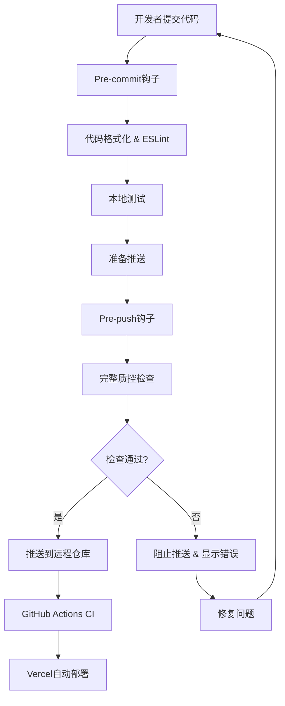

# CCPM360 质量控制流程详细指南

## 目录

- [概述](#概述)
- [质控流程架构](#质控流程架构)
- [自动化工具](#自动化工具)
- [检查项目详解](#检查项目详解)
- [故障排除指南](#故障排除指南)
- [团队协作规范](#团队协作规范)
- [持续改进](#持续改进)

## 概述

CCPM360项目采用多层次的质量控制体系，确保代码质量、构建稳定性和部署安全性。本指南详细说明了每个环节的执行标准和最佳实践。

### 质控目标

- 🎯 **零缺陷部署**: 确保生产环境部署的代码质量
- 🚀 **快速反馈**: 在开发早期发现和修复问题
- 🔒 **安全保障**: 防止敏感信息泄露和安全漏洞
- 📈 **性能优化**: 维持应用的高性能标准
- 🤝 **团队协作**: 统一代码标准和开发流程

## 质控流程架构



## 自动化工具

### 1. 脚本工具

#### `scripts/pre-deploy-check.js`

**功能**: 执行完整的部署前质量检查

**使用方法**:

```bash
# 完整检查
npm run pre-deploy

# 快速检查（跳过测试）
npm run pre-deploy:quick
```

**检查项目**:

- 代码质量检查 (ESLint, TypeScript)
- 构建验证 (Next.js build)
- 测试验证 (Vitest)
- 安全检查 (npm audit, 环境变量)
- 依赖完整性检查

### 2. Git钩子

#### `.husky/pre-commit`

- 自动格式化代码
- 执行基础的ESLint检查
- 运行快速测试

#### `.husky/pre-push`

- 执行完整的质控检查
- 阻止不符合标准的代码推送

### 3. Package.json脚本

```json
{
  "scripts": {
    "lint": "next lint",
    "lint:fix": "next lint --fix",
    "format": "prettier --write .",
    "format:check": "prettier --check .",
    "type-check": "tsc --noEmit",
    "test": "vitest",
    "test:run": "vitest run",
    "test:components": "vitest run --reporter=verbose src/components",
    "security:audit": "npm audit --audit-level=high",
    "security:fix": "npm audit fix",
    "pre-deploy": "node scripts/pre-deploy-check.js",
    "pre-deploy:quick": "npm run lint && npm run type-check && npm run build"
  }
}
```

## 检查项目详解

### 代码质量检查

#### ESLint检查

- **目的**: 确保代码符合团队编码规范
- **配置文件**: `eslint.config.mjs`
- **修复命令**: `npm run lint:fix`

**常见问题**:

- 未使用的变量和导入
- 不一致的代码风格
- 潜在的逻辑错误

#### TypeScript类型检查

- **目的**: 确保类型安全
- **命令**: `npm run type-check`
- **配置文件**: `tsconfig.json`

**常见问题**:

- 类型定义缺失
- 接口不匹配
- 泛型使用错误

#### 代码格式化

- **工具**: Prettier
- **配置文件**: `.prettierrc`
- **自动修复**: `npm run format`

### 构建验证

#### Next.js构建测试

- **目的**: 确保代码可以成功构建
- **命令**: `npm run build`
- **输出目录**: `.next/`

**检查内容**:

- 所有页面和组件可以正确编译
- 静态资源处理正确
- 构建优化生效

#### 依赖完整性检查

- **目的**: 确保所有导入的模块存在
- **检查范围**:
  - UI组件 (`src/components/ui/`)
  - 页面组件 (`src/pages/`)
  - 工具函数 (`src/utils/`)
  - API路由 (`src/app/api/`)

### 测试验证

#### 单元测试

- **框架**: Vitest
- **配置文件**: `vitest.config.ts`
- **测试目录**: `src/**/*.test.{ts,tsx}`

#### 组件测试

- **工具**: React Testing Library
- **命令**: `npm run test:components`
- **覆盖范围**: UI组件的渲染和交互

#### 测试覆盖率

- **命令**: `npm run test:coverage`
- **目标**: 保持80%以上的代码覆盖率

### 安全检查

#### 依赖安全扫描

- **工具**: npm audit
- **级别**: high (高危漏洞)
- **修复**: `npm run security:fix`

#### 环境变量安全

- **检查内容**:
  - 硬编码的API密钥
  - 敏感配置信息
  - 生产环境凭据

**安全规范**:

- 使用`.env.local`存储敏感信息
- 在`.env.example`中提供模板
- 确保`.env*`文件在`.gitignore`中

## 故障排除指南

### 构建失败

#### 模块未找到错误

```
Module not found: Can't resolve '@/components/ui/textarea'
```

**解决方案**:

1. 检查文件是否存在
2. 验证导入路径正确性
3. 确认TypeScript路径映射配置

#### TypeScript编译错误

```
Type 'string' is not assignable to type 'number'
```

**解决方案**:

1. 检查类型定义
2. 添加类型断言或类型守卫
3. 更新接口定义

### 测试失败

#### 快照测试失败

```
Snapshot test failed. Update snapshots?
```

**解决方案**:

1. 检查组件变更是否预期
2. 运行`npm run test -- -u`更新快照
3. 提交更新的快照文件

#### 异步测试超时

```
Test timeout of 5000ms exceeded
```

**解决方案**:

1. 增加测试超时时间
2. 使用`waitFor`等待异步操作
3. 模拟异步依赖

### 安全问题

#### 依赖漏洞

```
found 3 high severity vulnerabilities
```

**解决方案**:

1. 运行`npm audit fix`
2. 手动更新有漏洞的包
3. 考虑替换有问题的依赖

#### 敏感信息泄露

```
.env 可能包含硬编码的敏感信息
```

**解决方案**:

1. 移除硬编码的密钥
2. 使用环境变量
3. 更新`.gitignore`

## 团队协作规范

### 代码提交规范

#### 提交信息格式

```
type(scope): description

[optional body]

[optional footer]
```

**类型说明**:

- `feat`: 新功能
- `fix`: 修复bug
- `docs`: 文档更新
- `style`: 代码格式化
- `refactor`: 代码重构
- `test`: 测试相关
- `chore`: 构建过程或辅助工具的变动

#### 分支策略

- `main`: 生产环境分支
- `develop`: 开发环境分支
- `feature/*`: 功能开发分支
- `hotfix/*`: 紧急修复分支

### 代码审查清单

#### 功能性检查

- [ ] 功能实现符合需求
- [ ] 边界条件处理正确
- [ ] 错误处理完善
- [ ] 性能影响可接受

#### 代码质量检查

- [ ] 代码结构清晰
- [ ] 命名规范一致
- [ ] 注释充分且准确
- [ ] 无重复代码

#### 安全性检查

- [ ] 输入验证充分
- [ ] 权限控制正确
- [ ] 敏感信息保护
- [ ] SQL注入防护

## 持续改进

### 质控指标监控

#### 代码质量指标

- ESLint错误数量趋势
- TypeScript类型覆盖率
- 代码复杂度分析

#### 构建性能指标

- 构建时间趋势
- Bundle大小变化
- 依赖更新频率

#### 测试质量指标

- 测试覆盖率
- 测试执行时间
- 测试失败率

### 流程优化建议

#### 短期改进

1. 增加更多的自动化测试
2. 优化构建性能
3. 完善错误处理机制

#### 长期规划

1. 引入视觉回归测试
2. 实施性能预算控制
3. 建立质量门禁系统

### 工具升级计划

#### 定期更新

- 每月更新依赖包
- 每季度评估新工具
- 每年度回顾流程效果

#### 新技术评估

- 静态分析工具
- 性能监控工具
- 安全扫描工具

---

## 相关资源

- [项目根目录质控文档](../../QUALITY_CONTROL.md)
- [开发指南](../../DEVELOPMENT_GUIDE.md)
- [测试策略](../testing/strategy.md)
- [架构文档](../architecture/)

## 联系方式

如有质控流程相关问题，请联系：

- 技术负责人
- 在GitHub Issues中提出
- 团队技术讨论群
